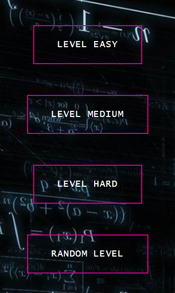
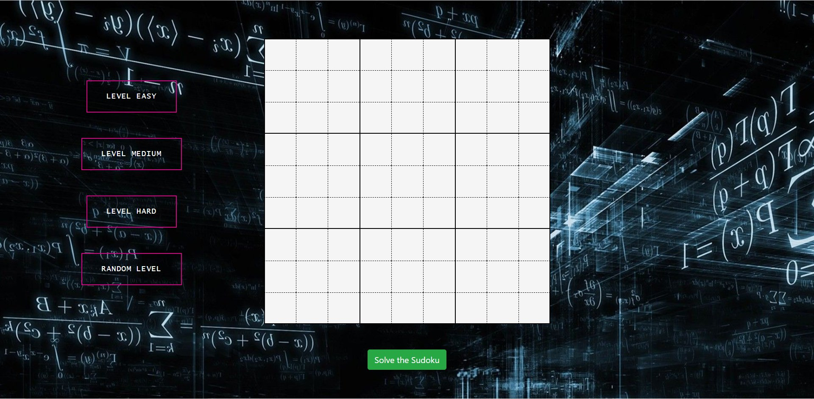
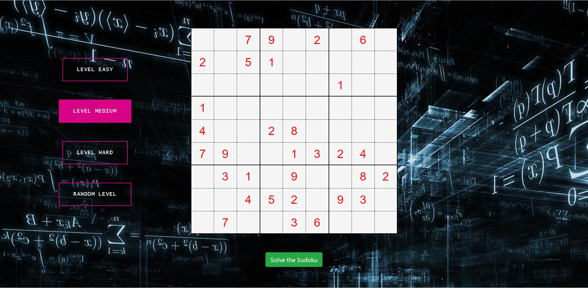
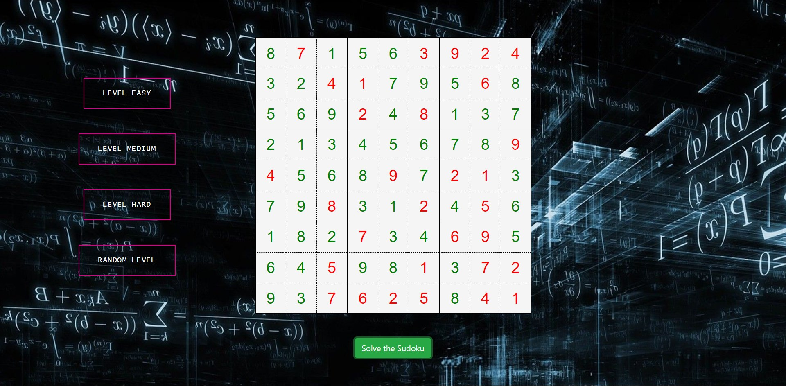

   
  
  <h1>🧩 Sudoku Generator and Solver 🧩</h1>
  <strong>Lets Make Sudoku Solving Easy</strong>

# Sudoku Solver Web App

This Web App Automatically Generates Sudoku Puzzle Based on Various Difficulty Level and Also Informs the Time Taken to Solve Them

### 🍀 Four Levels 

> Easy Level
> Medium Level
> Hard Level
> Random Level

  

### ➕ Intial View

  

### 🧩 Generate the Puzzle

>- After Clicking the Desired Level of Sudoku Puzzle, Wait for 1-2 Seconds for Sudoku Puzzle to Load

  

### 🤔 Solve the Sudoku Puzzle

>- Click on **Solve the Sudoku** Button

  

### ⌚ Time Taken to Solve

>- An Alert also Informs Regarding the Time Taken by Sudoku Solver to Solve the Puzzle

>- Easy Level

>- Medium Level

>- Hard Level

## 🤝 Contributing

We encourage you to contribute to Open Sauced! Please check out the [Contributing guide](/CONTRIBUTING.md) for guidelines about how to proceed.